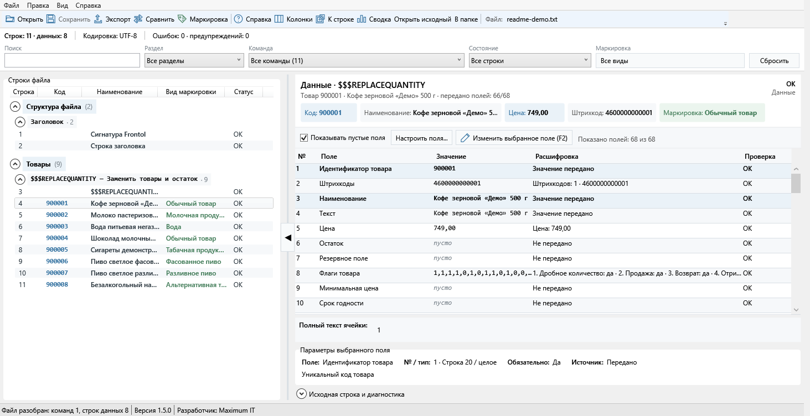

# Анализатор файлов обмена и отчётов о продажах Frontol 6

Windows-программа для разбора и проверки файлов обмена Frontol 6. Поддерживает файлы загрузки и отчёты о продажах, показывает документы, товары, оплаты, смены, группы печати, кеги, скидки и НДС. Формат определяется при выборе или перетаскивании файла.



## Для чего нужен

В строке обмена десятки значений разделены точкой с запятой. Если одно из них пропущено, сдвинуто или записано в неверном формате, искать причину в исходном файле неудобно. Анализатор связывает позиции со схемой команды или транзакции и показывает значение, источник, тип, назначение, расшифровку и результат проверки каждого поля.

Программа не подключается к Frontol и не запускает обмен. Файлы загрузки можно редактировать с резервным копированием; отчёты о продажах открываются в аналитическом режиме без действий, способных повредить обработанный отчёт.

## Возможности

### Разбор и проверка

- стартовый выбор «Файл загрузки в Frontol» / «Отчёт о продажах из Frontol»;
- отображение всех физических строк: шапки, команд, транзакций, данных, комментариев и пустых строк;
- группировка по разделам и командам с отдельным показом товаров и служебных данных;
- встроенный справочник раздела 17.2.1 «Загрузка данных» руководства интегратора Frontol 6;
- встроенный справочник раздела 17.2.2 «Выгрузка данных»: 56 типов транзакций и поля №1–44 для каждого типа;
- объяснение трёх строк шапки отчёта: признак обработки `#`/`@`, идентификатор БД и порядковый номер отчёта;
- корректный учёт завершающей `;`: технический пустой сегмент не принимается за поле №45;
- названия, типы, обязательность, значения по умолчанию и назначение полей;
- расшифровка флагов, операций ККМ, типов транзакций, оплат, скидок, статусов карт, единиц измерения и кодов маркировки;
- проверка обязательных значений, типов, длины строк и количества полей;
- сохранение пустых и завершающих полей при разборе строки по `;`.

### Навигация по большому файлу

- поиск с подсветкой совпадений;
- совместные фильтры по разделу, команде, состоянию и нескольким видам маркировки;
- переход к физической строке по `Ctrl+G`;
- закреплённая карточка товара с основными реквизитами;
- настройка состава и ширины колонок;
- список последних открытых файлов;
- сводка по строкам, командам, ошибкам и видам маркировки;
- экспорт текущей выборки в CSV;
- сравнение товаров двух файлов по коду, названию, цене, штрихкоду и маркировке.

### Понятный отчёт о продажах

- вкладка «Обзор» с продажами, возвратами, чистым итогом, средним чеком, количеством товаров и сменами;
- сборка исходных транзакций в документы Frontol: шапка, товары, оплаты и полная цепочка строк;
- универсальное представление будущей загрузки в 1С без привязки к конкретной конфигурации;
- отдельные вкладки документов, товаров, оплат, смен, сверки, кегов, скидок/НДС, транзакций и справочных сценариев;
- разделение для 1С по полям №27 «Идентификатор предприятия» и №17 «Код группы печати» без автоматического назначения организации;
- итог группы берётся из транзакции №49, фискальная оплата — из №43, распределения бонусов, предоплаты и нефискальной оплаты — из №82/83/84/86;
- общие оплаты №32/33/34/36/40 не суммируются повторно с распределительными строками;
- продажи, возвраты, сторно, отменённые и незавершённые документы различаются; №58 считается нефинансовым закрытием;
- сменные итоги документов сверяются с программным итогом №61 и аппаратным итогом ККТ №63;
- контролируются дубли и пропуски номеров транзакций, диапазоны и последовательность отчётов одной базы;
- экспорт отчёта включает все собранные разделы, а не только исходные строки;
- справка по всем видам операций и особым правилам руководства остаётся доступной, даже если примера нет в текущем файле;
- отдельные объяснения для вскрытия тары, постановки и снятия пивного кега с крана, списания остатка, маркировки, скидок, бонусов, предоплат, рецептов, ОФД и других сценариев.

### Редактирование

- удобные редакторы полей: однострочный ввод, выбор из справочника и флаги товара в виде флажков; для поля 55 можно также ввести новый числовой код, которого ещё нет в справочнике;
- массовая замена вида маркировки для одной или нескольких групп, в том числе на произвольный код;
- изменение отдельного поля по `F2` или всей исходной строки в расширенном режиме;
- повторная проверка строки сразу после изменения;
- выделение изменённых строк;
- сохранение поверх исходного файла или в новый файл;
- сохранение исходной кодировки и типа перевода строк.

## Быстрый старт

Готовые сборки размещаются на странице [Releases](https://github.com/RadchenkoMaxim/FrontolRazborFile/releases). Если там уже опубликована нужная версия:

1. Скачайте архив для `win-x64` с пометкой `self-contained`.
2. Распакуйте архив в отдельную папку.
3. Запустите `FrontolFileAnalyzer.exe`.
4. Выберите «Файл загрузки в Frontol» или «Отчёт о продажах».
5. Укажите файл. Для автоматического распознавания можно перетащить его в окно или нажать `Ctrl+O`.

Установка не требуется. В self-contained сборку включён .NET 10 Desktop Runtime.

Если на странице Releases ещё нет готовой сборки, программу можно собрать из исходников по инструкции ниже.

## Безопасное редактирование

До нажатия «Сохранить» изменения находятся только в рабочей копии программы. При сохранении поверх существующего файла рядом создаётся резервная копия с расширением `.bak`. Команда «Сохранить как» позволяет оставить исходный файл без изменений.

Перед заменой рабочего файла обмена рекомендуется:

1. остановить обмен в учётной системе и Frontol;
2. сохранить файл под новым именем;
3. проверить изменённые строки;
4. только после этого подменять файл, который будет загружен в Frontol.

Резервная копия помогает отменить последнее сохранение, но не заменяет штатное резервное копирование каталога обмена.

## Поддерживаемые форматы и кодировки

Поддерживаются текстовые файлы загрузки Frontol 6 с командами `$$$...` и отчёты о продажах по разделу 17.2.2. В отчёте одна физическая строка соответствует одной транзакции; тип находится в поле №4. Frontol может выгружать строку до поля №36 или №44 и завершает её точкой с запятой.

Поддерживаемые кодировки:

- Windows-1251;
- UTF-8 без BOM;
- UTF-8 с BOM;
- UTF-16 LE с BOM;
- UTF-16 BE с BOM.

Кодировка определяется при открытии. При сохранении программа использует ту же кодировку и сохраняет исходный стиль перевода строк.

## Системные требования

Для готовой self-contained сборки:

- Windows 10 или Windows 11 x64;
- права на чтение исходного файла и запись в каталог сохранения;
- отдельная установка .NET не нужна.

Для сборки из исходников нужен [.NET 10 SDK](https://dotnet.microsoft.com/download/dotnet/10.0).

## Сборка из исходников

```powershell
git clone https://github.com/RadchenkoMaxim/FrontolRazborFile.git
cd .\FrontolRazborFile
dotnet restore .\FrontolFileAnalyzer.slnx --configfile .\NuGet.Config
dotnet build .\FrontolFileAnalyzer.slnx -c Release --no-restore
```

Публикация одного EXE для Windows x64:

```powershell
dotnet restore .\src\FrontolFileAnalyzer\FrontolFileAnalyzer.csproj `
  -r win-x64 --configfile .\NuGet.SelfContained.Config

dotnet publish .\src\FrontolFileAnalyzer\FrontolFileAnalyzer.csproj `
  -c Release -r win-x64 --self-contained true --no-restore `
  -p:PublishSingleFile=true `
  -p:IncludeNativeLibrariesForSelfExtract=true `
  -p:EnableCompressionInSingleFile=true `
  -o .\artifacts\FrontolFileAnalyzer-win-x64-self-contained
```

## Проверка

В репозитории есть консольный smoke-тест и небольшие контрольные файлы:

```powershell
dotnet run --project .\tests\FrontolFileAnalyzer.SmokeTests\FrontolFileAnalyzer.SmokeTests.csproj -- `
  .\tests\fixtures\base-sample.txt
```

Дополнительно можно передать вторым аргументом путь к полному файлу обмена:

```powershell
dotnet run --project .\tests\FrontolFileAnalyzer.SmokeTests\FrontolFileAnalyzer.SmokeTests.csproj -- `
  .\tests\fixtures\base-sample.txt "C:\Путь к обмену\base.txt"
```

Тест проверяет разбор строк, кодировки, оба направления обмена, схемы полей, повторный разбор после редактирования, покрытие команд и всех 56 типов транзакций. Отдельный сценарий проверяет чек с группами печати 1 и 2, фискальную и нефискальную оплаты, бонусный возврат, распределения №43/83/86 и исключение отменённого чека. Дополнительным аргументом можно передать полный `base.txt` или полный отчёт о продажах.

## Ограничения

- Справочники составлены для форматов загрузки и выгрузки Frontol 6 по разделам 17.2.1 и 17.2.2 руководства интегратора от 2026 года. Форматы других версий Frontol могут отличаться.
- Структурная проверка не заменяет контрольную загрузку: часть бизнес-правил проверяется только самим Frontol и подключёнными системами.
- Сравнение файлов работает с товарными строками и не сравнивает все служебные справочники.
- Редактирование, массовая замена маркировки и сравнение доступны для файлов загрузки; отчёт о продажах анализируется без изменения исходных транзакций.
- Программа не изменяет базу Frontol и не управляет настройками обмена.

## Основа справочника

Описания команд и полей загрузки перенесены из «Руководства интегратора» Frontol 6, разделы 17.2.1.1–17.2.1.124, страницы 190–272. Справочник транзакций отчёта о продажах основан на разделе 17.2.2.1, страницы 272–318. Для каждой транзакции подписаны все позиции №1–44, включая неиспользуемые и резервные поля.

## Разработчик

Maximum IT · [maximumit25.ru](https://maximumit25.ru) · [RadchenkoMaxim](https://github.com/RadchenkoMaxim)
